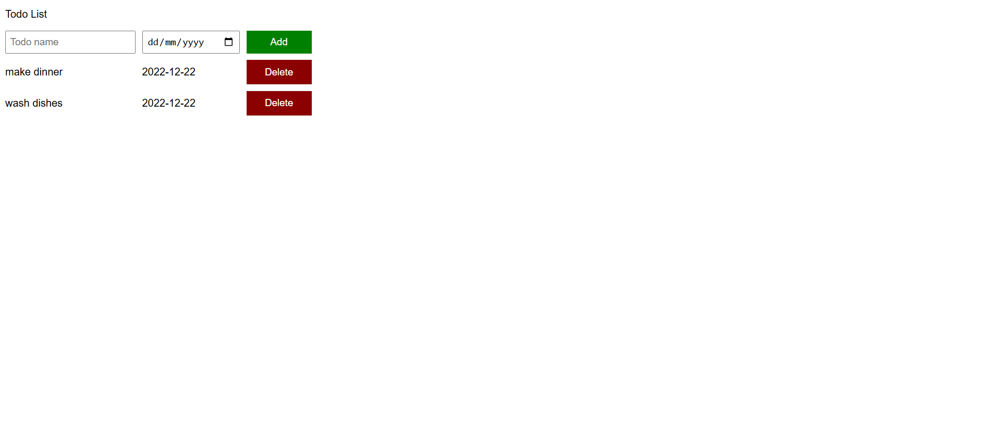

# JavaScript Todo List

A simple Todo List web application built using **HTML, CSS, and JavaScript**.  
The app allows users to add tasks with a due date and delete them dynamically using DOM manipulation.

## Features

- Add new tasks
- Assign a due date to each task
- Delete tasks from the list
- Dynamic rendering using JavaScript
- Clean and simple UI

## Technologies Used

- HTML
- CSS
- JavaScript
- DOM Manipulation

## Screenshot

## How to Run

1. Clone the repository :
   git clone https://github.com/kadriazmi/javascript-todo-list.git
2. Open `index.html` in your browser.

## What I Practiced

This project helped me practice:

- JavaScript arrays
- Objects
- DOM manipulation
- Event listeners
- Dynamic UI rendering

## Live Demo

🚀 [View Live Demo](https://kadriazmi.github.io/javascript-todo-list/)
